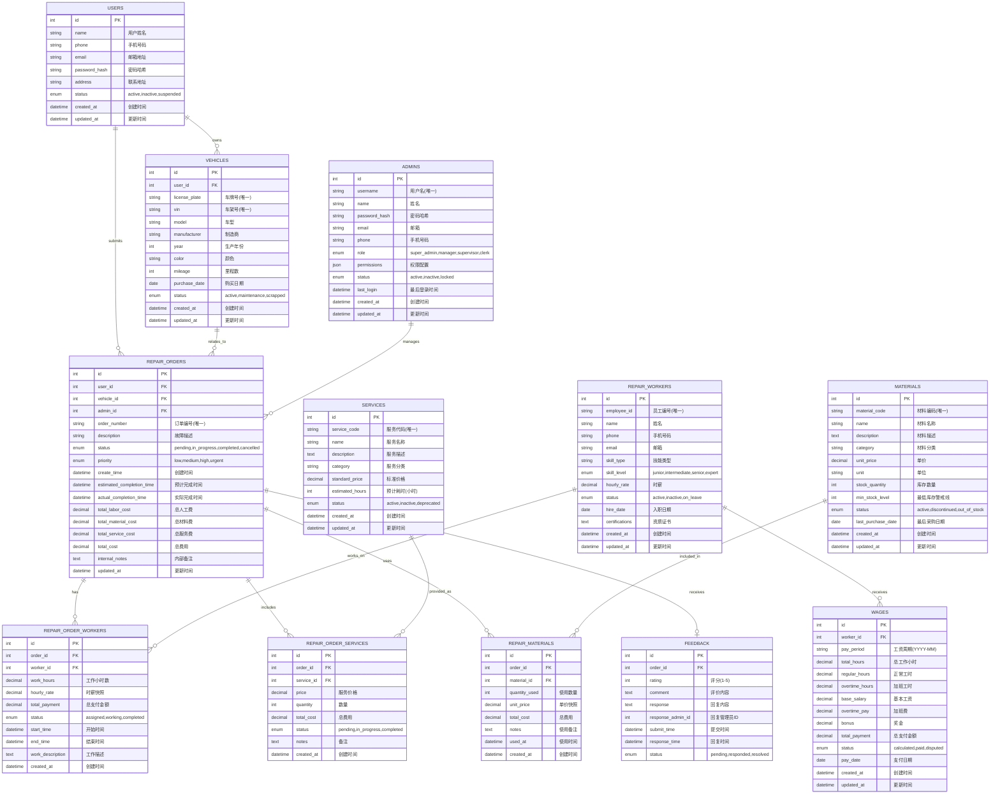

```mermaid
erDiagram
    %% 用户和车辆关系
    USERS ||--o{ VEHICLES : owns
    USERS ||--o{ REPAIR_ORDERS : submits
    
    %% 车辆和维修订单关系
    VEHICLES ||--o{ REPAIR_ORDERS : relates_to
    
    %% 维修订单核心关系
    REPAIR_ORDERS ||--o{ REPAIR_ORDER_WORKERS : has
    REPAIR_ORDERS ||--o{ REPAIR_ORDER_SERVICES : includes
    REPAIR_ORDERS ||--o{ REPAIR_MATERIALS : uses
    REPAIR_ORDERS ||--o| FEEDBACK : receives
    
    %% 工人和服务关系
    REPAIR_WORKERS ||--o{ REPAIR_ORDER_WORKERS : works_on
    SERVICES ||--o{ REPAIR_ORDER_SERVICES : provided_as
    
    %% 材料关系（移除供应商）
    MATERIALS ||--o{ REPAIR_MATERIALS : included_in
    
    %% 工资和管理关系
    REPAIR_WORKERS ||--o{ WAGES : receives
    ADMINS ||--o{ REPAIR_ORDERS : manages

    %% 用户表
    USERS {
        int id PK
        string name "用户姓名"
        string phone "手机号码"
        string email "邮箱地址"
        string password_hash "密码哈希"
        string address "联系地址"
        enum status "active,inactive,suspended"
        datetime created_at "创建时间"
        datetime updated_at "更新时间"
    }

    %% 车辆表
    VEHICLES {
        int id PK
        int user_id FK
        string license_plate "车牌号(唯一)"
        string vin "车架号(唯一)"
        string model "车型"
        string manufacturer "制造商"
        int year "生产年份"
        string color "颜色"
        int mileage "里程数"
        date purchase_date "购买日期"
        enum status "active,maintenance,scrapped"
        datetime created_at "创建时间"
        datetime updated_at "更新时间"
    }

    %% 维修订单表
    REPAIR_ORDERS {
        int id PK
        int user_id FK
        int vehicle_id FK
        int admin_id FK
        string order_number "订单编号(唯一)"
        string description "故障描述"
        enum status "pending,in_progress,completed,cancelled"
        enum priority "low,medium,high,urgent"
        datetime create_time "创建时间"
        datetime estimated_completion_time "预计完成时间"
        datetime actual_completion_time "实际完成时间"
        decimal total_labor_cost "总人工费"
        decimal total_material_cost "总材料费"
        decimal total_service_cost "总服务费"
        decimal total_cost "总费用"
        text internal_notes "内部备注"
        datetime updated_at "更新时间"
    }

    %% 维修工人表
    REPAIR_WORKERS {
        int id PK
        string employee_id "员工编号(唯一)"
        string name "姓名"
        string phone "手机号码"
        string email "邮箱"
        string skill_type "技能类型"
        enum skill_level "junior,intermediate,senior,expert"
        decimal hourly_rate "时薪"
        enum status "active,inactive,on_leave"
        date hire_date "入职日期"
        text certifications "资质证书"
        datetime created_at "创建时间"
        datetime updated_at "更新时间"
    }

    %% 维修订单工人关联表
    REPAIR_ORDER_WORKERS {
        int id PK
        int order_id FK
        int worker_id FK
        decimal work_hours "工作小时数"
        decimal hourly_rate "时薪快照"
        decimal total_payment "总支付金额"
        enum status "assigned,working,completed"
        datetime start_time "开始时间"
        datetime end_time "结束时间"
        text work_description "工作描述"
        datetime created_at "创建时间"
    }

    %% 服务项目表
    SERVICES {
        int id PK
        string service_code "服务代码(唯一)"
        string name "服务名称"
        text description "服务描述"
        string category "服务分类"
        decimal standard_price "标准价格"
        int estimated_hours "预计耗时(小时)"
        enum status "active,inactive,deprecated"
        datetime created_at "创建时间"
        datetime updated_at "更新时间"
    }

    %% 维修订单服务关联表
    REPAIR_ORDER_SERVICES {
        int id PK
        int order_id FK
        int service_id FK
        decimal price "服务价格"
        int quantity "数量"
        decimal total_cost "总费用"
        enum status "pending,in_progress,completed"
        text notes "备注"
        datetime created_at "创建时间"
    }

    %% 材料表（移除供应商字段）
    MATERIALS {
        int id PK
        string material_code "材料编码(唯一)"
        string name "材料名称"
        text description "材料描述"
        string category "材料分类"
        decimal unit_price "单价"
        string unit "单位"
        int stock_quantity "库存数量"
        int min_stock_level "最低库存警戒线"
        enum status "active,discontinued,out_of_stock"
        date last_purchase_date "最后采购日期"
        datetime created_at "创建时间"
        datetime updated_at "更新时间"
    }

    %% 维修订单材料关联表
    REPAIR_MATERIALS {
        int id PK
        int order_id FK
        int material_id FK
        int quantity_used "使用数量"
        decimal unit_price "单价快照"
        decimal total_cost "总费用"
        text notes "使用备注"
        datetime used_at "使用时间"
        datetime created_at "创建时间"
    }

    %% 反馈表
    FEEDBACK {
        int id PK
        int order_id FK
        int rating "评分(1-5)"
        text comment "评价内容"
        text response "回复内容"
        int response_admin_id "回复管理员ID"
        datetime submit_time "提交时间"
        datetime response_time "回复时间"
        enum status "pending,responded,resolved"
    }

    %% 工资表
    WAGES {
        int id PK
        int worker_id FK
        string pay_period "工资周期(YYYY-MM)"
        decimal total_hours "总工作小时"
        decimal regular_hours "正常工时"
        decimal overtime_hours "加班工时"
        decimal base_salary "基本工资"
        decimal overtime_pay "加班费"
        decimal bonus "奖金"
        decimal total_payment "总支付金额"
        enum status "calculated,paid,disputed"
        date pay_date "支付日期"
        datetime created_at "创建时间"
        datetime updated_at "更新时间"
    }

    %% 管理员表
    ADMINS {
        int id PK
        string username "用户名(唯一)"
        string name "姓名"
        string password_hash "密码哈希"
        string email "邮箱"
        string phone "手机号码"
        enum role "super_admin,manager,supervisor,clerk"
        json permissions "权限配置"
        enum status "active,inactive,locked"
        datetime last_login "最后登录时间"
        datetime created_at "创建时间"
        datetime updated_at "更新时间"
    }
```